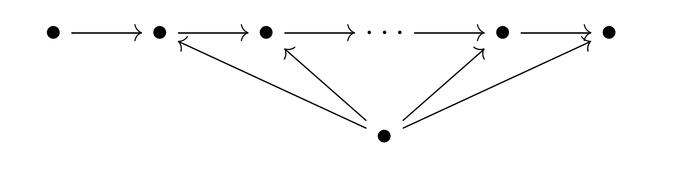

# The QR Decomposition for radial neural networks

This repository accompanies the paper "The QR decomposition for radial neural networks".

## The file source.py

### The representation class

We create a class for representations of the neural quiver:

with L + 1 vertices in the top row and a 'bias vertex' at the bottom. We only consider dimension vectors whose value at the bias vertex is equal to 1.  

- The QR decomposition of the representation W, that is, W = QR + U

- The reduced representation ('R' from the QR decomposition)

- The transformed representation Q^{-1}W.

### Radial neural networks

We use PyTorch modules to implement radial activation functions in the class RadAct where there is an option to add a shift. We then implement radial neural networks in the class RadNet which has methods to:

- Set the weights.

- Export the weights 'W'.

- Export the reduced network (with weights R from the QR decomposition for the weights W).

- Export the transformed network (with weights Q^{-1} W where Q is from the QR decomposition for W).

### Training

For training models, we have three different types of training loops:

- A basic training loop with usual gradient descent. There is no optimizer in order to remove randomness. 

- A training loop with projected gradient descent. We define the appropriate masks in order to implement this properly. 

- A training loop with usual gradient descent and a stopping value for the loss function

## The file script-experiment-6-1-and-6-2.py

In this experiment, we instantiate a radial neural network with weights W and show that projected gradient descent on the transformed network (with weights Q^{-1} W) matches usual gradient descent on the reduced network (with weights R). Specifically, the values of the loss function are the same in both training regimes, epoch by epoch. 

    python script-experiment-6-1-and-6-2.py

## The file script-experiment-6-3.py

In this experiment, we instantiate a radial neural network with weights W and a somewhat large dimension vector. We train both the original model and the reduced model (with weights R coming from the QR decomposition of W) with usual gradient descent using a stopping value for the loss function. We show that the reduced model achieves this low value for the loss function after less time (albeit after more epochs).

    python script-experiment-6-3.py